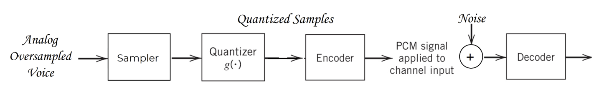

# Voice-codecs
A PCM-Based Vocoder/Decoder, a voice codec software based on PCM of voice signals to send over data network, whose quantizer provides both mid-rise and mid-tread quantization techniques, and an encoder with both Manchester and AMI signaling, providing the concept of AWGN channel, and regenerative repeaters.

## System

<figure>

<figcaption align="center"><i>fig. 1 PCM-based Vocoder/Decoder</i></figcaption>
</figure>

## Test case I
### Modules Configuration
#### Sampler
- The required sampling rate, fs = 5 KHz.
- The actual sampling rate after the downsampling, Fs = 4.8 KHz.

#### Quantizer
- Quantization Mode: Mid rise.
- Number of levels, L = 256.

#### Encoder
- Line Code: Manchester Signaling.
- Pulse Amplitude = 5 volt.
- Bit Rate, Rb = 10K bit/sec.

#### Channel (AWGN-channel)
- Noise Power = 4 dB.
---
### Results
#### Input audio signal

https://github.com/MoEssamKhattab/Voice-codecs/assets/95503706/f959a054-01f9-4a81-9f4e-97de8766b173

#### Quantizer Output

<figure>

<figcaption Align="center"><i>fig. 2 Input Signal vs. Quantized Signal</i></figcaption>
</figure>

The following figure (Fig. 3) may show the output of the quantizer, and the difference between the input audio signal and the quantized signal more properly.

<figure align="center">

<figcaption Align="center"><i>fig. 3 Input Signal vs. Quantized Signal</i></figcaption>
</figure>

Bit stream (first 20 bits):

| 1 | 0 | 0 | 0 | 0 | 1 | 1 | 1 | 1 | 0 | 0 | 0 | 0 | 1 | 1 | 1 | 1 | 0 | 0 | 0 |
|-|-|-|-|-|-|-|-|-|-|-|-|-|-|-|-|-|-|-|-|
---
#### Encoder Output
<figure>

<figcaption Align="center"><i>fig. 4 Encoder Output</i></figcaption>
</figure>

We can see that the line code properly matches the output bit stream of the quantizer.

---

#### Channel Output

<figure>

<figcaption Align="center"><i>fig. 5 Channel Output</i></figcaption>
</figure>

---

#### Regenerative Repeater Output

<figure>

<figcaption Align="center"><i>fig. 6 Regenerative Repeater Output</i></figcaption>
</figure>

---

#### Decoder Output

<figure>

<figcaption Align="center"><i>fig. 7 Decoder Output (The Restored Signal)</i></figcaption>
</figure>

The following figure (Fig. 8) may show the output of the decoder, the restored signal, more properly.

<figure Align = "center">

<figcaption Align="center"><i>fig. 8 Decoder Output (The Restored Signal)</i></figcaption>
</figure>

#### Output Audio Signal

https://github.com/MoEssamKhattab/Voice-codecs/assets/95503706/ff339c19-6f3f-4764-83cd-0848ab8b36d0